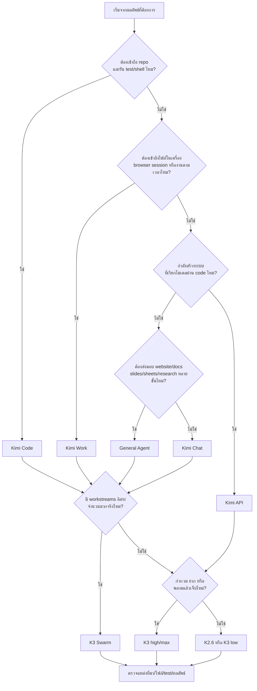
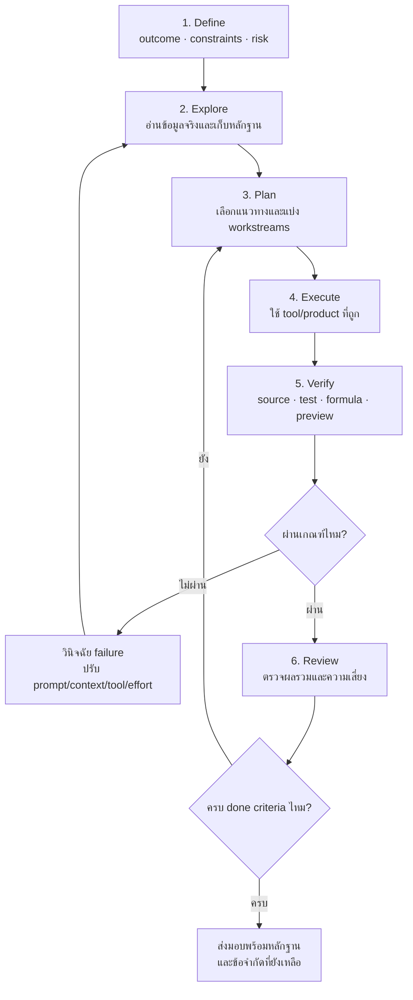
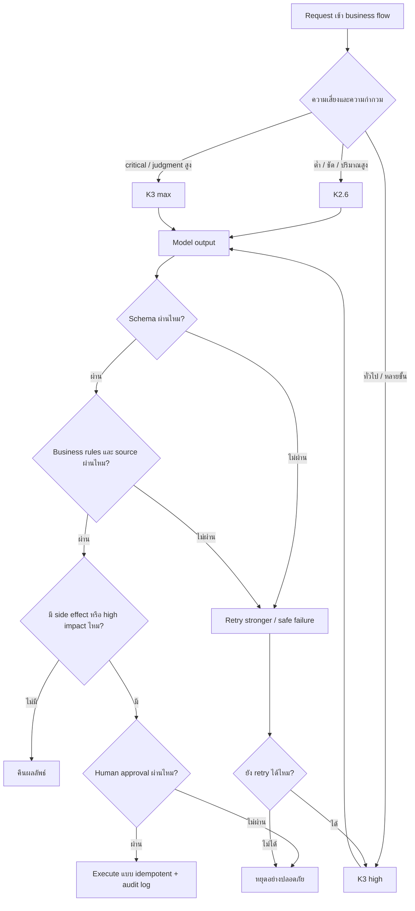
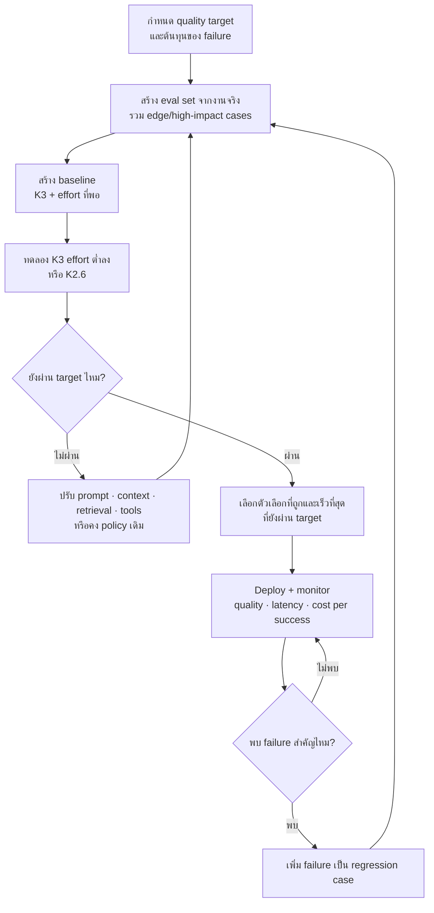

# เลือกและใช้ Kimi ให้เต็มประสิทธิภาพ

> **หลักเดียวที่ต้องจำ:** เลือกจากผลลัพธ์และความเสี่ยงของงาน ไม่ใช่จากชื่อฟีเจอร์
>
> ใช้พื้นผิวที่เข้าถึงข้อมูลและเครื่องมือได้ถูกต้อง → ใช้โมเดล/ระดับคิดที่พอเหมาะ → ตรวจผลงานด้วยหลักฐานจริง

คู่มือนี้อธิบายการเลือกใช้ **K2.6, K3, K3 Swarm, General Agent, Kimi Work, Kimi Code, Kimi Claw และ Kimi API** สำหรับงานสนทนา ค้นคว้า เอกสาร ข้อมูล เว็บไซต์ software development และระบบ production

โครงเรื่องพัฒนาต่อจาก [zgame555/how-to-use-gpt](https://github.com/zgame555/how-to-use-gpt) แต่ปรับแนวคิด ตัวอย่าง และคำแนะนำให้ตรงกับผลิตภัณฑ์ของ Kimi โดยไม่สมมติว่าโมเดลหรือฟีเจอร์ของสองค่ายเทียบกันแบบหนึ่งต่อหนึ่ง

ข้อมูลผลิตภัณฑ์ โมเดล และราคาอัปเดตล่าสุด: **2 สิงหาคม 2026** — ชื่อรุ่น availability, credit, ราคา และ UI เปลี่ยนได้เสมอ โปรดตรวจ [Kimi Help Center](https://www.kimi.com/help), [Kimi API docs](https://platform.kimi.ai/docs/overview), [Kimi Code docs](https://www.kimi.com/code/docs/en/) และ [Pricing](https://platform.kimi.ai/docs/pricing/chat) ก่อนนำตัวเลขไปใช้ตัดสินใจทางธุรกิจ

---

## สารบัญ

1. [แยกผลิตภัณฑ์ของ Kimi ให้ออกก่อน](#1-แยกผลิตภัณฑ์ของ-kimi-ให้ออกก่อน)
2. [รู้จัก K2.6, K3 และ K3 Swarm](#2-รู้จัก-k26-k3-และ-k3-swarm)
3. [เลือกภายใน 30 วินาที](#3-เลือกภายใน-30-วินาที)
4. [เริ่มใช้และสลับโหมดอย่างไร](#4-เริ่มใช้และสลับโหมดอย่างไร)
5. [คันโยกที่สำคัญกว่าการเปลี่ยนโมเดล](#5-คันโยกที่สำคัญกว่าการเปลี่ยนโมเดล)
6. [สูตรทำงานที่ใช้ได้กับทุกโปรเจกต์](#6-สูตรทำงานที่ใช้ได้กับทุกโปรเจกต์)
7. [เลือกตามสายงาน](#7-เลือกตามสายงาน)
8. [เคสจริง](#8-เคสจริง)
9. [ออกแบบระบบด้วย Kimi API](#9-ออกแบบระบบด้วย-kimi-api)
10. [วัดคุณภาพด้วย evals](#10-วัดคุณภาพด้วย-evals)
11. [คำนวณและลดต้นทุน](#11-คำนวณและลดต้นทุน)
12. [สัญญาณว่าเลือกวิธีทำงานผิด](#12-สัญญาณว่าเลือกวิธีทำงานผิด)
13. [เรื่องที่เข้าใจผิดบ่อย](#13-เรื่องที่เข้าใจผิดบ่อย)
14. [กฎสำหรับงานเสี่ยงสูง](#14-กฎสำหรับงานเสี่ยงสูง)
15. [มุมมองแบบ senior](#15-มุมมองแบบ-senior)
16. [Cheat sheet](#16-cheat-sheet)
17. [แหล่งอ้างอิงทางการ](#17-แหล่งอ้างอิงทางการ)

---

## 1. แยกผลิตภัณฑ์ของ Kimi ให้ออกก่อน

คำว่า “ใช้ Kimi” อาจหมายถึงผลิตภัณฑ์คนละแบบ ซึ่งมีข้อมูล เครื่องมือ ขอบเขตสิทธิ์ และวิธีคิดค่าใช้จ่ายต่างกัน

| พื้นผิว | เหมาะกับ | จุดเด่น | ค่าใช้จ่ายหลัก |
|---|---|---|---|
| **Kimi Chat — web/mobile** | ถามตอบ วิเคราะห์ เขียน ค้นข้อมูล ทำงานกับไฟล์ | เริ่มเร็ว มี web search, memory และ multimodal ในผลิตภัณฑ์ | free tier หรือ membership credits ตามรุ่น/ฟีเจอร์ |
| **General Agent** | งานหลายขั้นที่ต้องส่งมอบเว็บไซต์ สไลด์ เอกสาร ชีต หรือรายงาน | วางแผนและเลือกเครื่องมือให้อัตโนมัติ | membership credits ตามทรัพยากรที่ใช้ |
| **K3 Swarm** | ค้นหรือประมวลผลหลายเรื่องที่เป็นอิสระพร้อมกัน | กระจายงานให้ sub-agents แล้วรวมผล | membership credits สูงกว่า Agent ปกติ |
| **Kimi Work** | ทำงานกับไฟล์ในเครื่อง browser ที่ login อยู่ และงานตามเวลา | Local Agent, WebBridge, Python/shell, skills, scheduled tasks | membership/สิทธิ์ตาม plan |
| **Kimi Code** | อ่าน แก้ ทดสอบ และ review code ใน repository | CLI, VS Code, terminal tools, `AGENTS.md`, MCP | membership หรือ Kimi Code API |
| **Kimi Claw** | ผู้ช่วย cloud ที่ทำงานต่อเนื่องและ automation 24/7 | persistent agent, integrations และ skills | membership/credits ตาม plan |
| **Kimi API** | ฝังโมเดลใน product, backend, agent และ automation | ควบคุม model, prompt, tools, schema และ routing เอง | pay-as-you-go แยกจาก membership |

สิ่งสำคัญ:

- **Kimi Chat/Agent ไม่เหมือน Kimi API** — system prompt, tools, memory, context management และ product policy ต่างกัน ผลจากหน้าเว็บจึงไม่ใช่ benchmark ของ API โดยอัตโนมัติ
- **Kimi Membership, Kimi Code และ Kimi Open Platform เป็นคนละระบบบัญชี/สิทธิ์** — API key, balance และ credits อาจใช้ข้ามกันไม่ได้
- ชื่อที่เห็นใน UI เช่น K3 หรือ K3 Swarm ไม่จำเป็นต้องตรงกับ model ID ใน API หรือ Kimi Code
- Agent, Websites, Slides, Docs, Sheets และ Deep Research เป็นความสามารถของผลิตภัณฑ์ ไม่ใช่ “ทีม Agent” ที่ผู้ใช้ต้องส่งงานตามลำดับตายตัว
- availability ขึ้นกับ region, plan, client version และ policy ปัจจุบัน ให้เชื่อ model picker และหน้า account ของตนเองเป็นหลัก

### Product, model, mode และ tool ต่างกันอย่างไร

```text
Product   = เข้าใช้งานที่ไหน       เช่น Kimi.com, Kimi Work, Kimi Code, API
Model     = สมองที่ประมวลผล        เช่น K2.6, K3
Mode      = วิธีใช้สมอง             เช่น Chat, Agent, Swarm, Low/High/Max
Tool      = สิ่งที่ลงมือแทนโมเดล    เช่น web search, browser, Python, shell
Skill     = workflow ที่นำกลับใช้ซ้ำ เช่น รูปแบบรายงานหรือขั้นตอนตรวจเอกสาร
```

หลายครั้งการเลือก **product/tool ให้ถูก** เพิ่มคุณภาพมากกว่าการเปลี่ยน K2.6 เป็น K3 เช่น งานที่ต้องใช้ข้อมูลล่าสุดควรได้ search พร้อมแหล่งที่มา และงานแก้ repo ควรอยู่ใน Kimi Code ที่รัน test ได้

---

## 2. รู้จัก K2.6, K3 และ K3 Swarm

### โมเดลใน Kimi Chat และ Kimi API

| รุ่น/โหมด | บทบาท | Context สูงสุด | ความสามารถเด่น | เลือกเมื่อ |
|---|---|---:|---|---|
| **K2.6** | รุ่นเร็วและประหยัดกว่า | 256K | text, image, video; เปิด/ปิด thinking ได้ใน API | สนทนา งานชัด งานทั่วไป latency/cost สำคัญ |
| **K3** | flagship ที่เก่งที่สุดโดยรวม | 1M | native vision, long-horizon coding, knowledge work; reasoning `low/high/max` | งานยาก กำกวม ยาว มูลค่าสูง หรือใช้ tools หลายขั้น |
| **K3 Swarm** | multi-agent mode ที่ขยาย K3 ในแนวนอน | ขึ้นกับผลิตภัณฑ์ | แบ่งงานอิสระให้ sub-agents ทำพร้อมกันแล้วรวมผล | ค้นจำนวนมาก batch processing อ่านเอกสารกว้าง หรือสร้างชิ้นงานหลายส่วน |

K3 Swarm **ไม่ใช่ API model ID ทั่วไปสำหรับแทน `kimi-k3`** แต่เป็นโหมด Agent ในผลิตภัณฑ์ Kimi ซึ่งเพิ่ม orchestration และใช้ทรัพยากรมากกว่า

### Model ID เปลี่ยนตามพื้นผิว

| พื้นผิว | K3 | รุ่นประหยัด/งานทั่วไป | หมายเหตุ |
|---|---|---|---|
| **Kimi Chat/Agent** | `K3` | `K2.6` | เลือกจาก model picker |
| **Kimi API** | `kimi-k3` | `kimi-k2.6` | OpenAI-compatible Chat Completions |
| **Kimi Code** | `k3`, `k3-256k` | `kimi-for-coding` | มี `kimi-for-coding-highspeed` ตาม plan |

ห้ามคัดลอก model ID ข้ามผลิตภัณฑ์โดยเดา เช่น `k3` ของ Kimi Code ไม่ใช่ชื่อเดียวกับ `kimi-k3` ของ Open Platform

### Thinking / reasoning

K3 คิดเสมอ ระดับที่เลือกได้คือ:

```text
low → high → max
```

| ระดับ | เริ่มใช้กับ |
|---|---|
| `low` | งานตรงไปตรงมา ต้องการลด latency และ reasoning tokens |
| `high` | งานทั่วไปที่มีหลายขั้น ใช้ tools หรือมี trade-off |
| `max` | architecture, debug ยาก, critical review และงานที่คุณภาพสำคัญกว่าเวลา |

ใน Kimi API ค่า default ของ K3 คือ `max` หากไม่ระบุ จึงควรตั้งใจเลือกและวัดผล ไม่ปล่อย default โดยไม่รู้ต้นทุน ส่วน K2.6 เปิดหรือปิด thinking ได้ เหมาะกับ workload ที่ต้องสลับระหว่างคำตอบเร็วกับการคิดลึก

### ราคา Kimi API

ราคา Standard ต่อ 1 ล้าน tokens (USD) ณ วันที่อัปเดต:

| โมเดล | Cached input | Uncached input | Output | Context |
|---|---:|---:|---:|---:|
| `kimi-k3` | $0.30 | $3.00 | $15.00 | 1,048,576 |
| `kimi-k2.6` | $0.16 | $0.95 | $4.00 | 262,144 |

ข้อสังเกต:

- K3 แพงกว่า K2.6 ประมาณ 3.2 เท่าที่ uncached input และ 3.75 เท่าที่ output
- output ของ K3 แพงกว่า uncached input 5 เท่า การขอคำตอบยาวโดยไม่จำเป็นเพิ่มต้นทุนเร็ว
- Kimi API พยายามทำ context caching ให้อัตโนมัติ การรักษา prefix แรกของ prompt, tools และเอกสารให้คงที่ช่วยเพิ่ม cache hit
- built-in web search คิดค่าบริการเพิ่ม **$0.004 ต่อ invocation** ตาม pricing ปัจจุบัน
- K3 ใช้ราคาเท่ากันตลอด context window ไม่มี long-context tier แยกในราคา ณ วันที่อัปเดต

ราคา API ไม่เท่ากับ membership credits บน Kimi.com ตาม Help Center ปัจจุบัน K2.6 ใน Chat ไม่ใช้ credits ส่วน K3, K3 Swarm และ Agent features ใช้ credits ตามทรัพยากรจริง รายละเอียดอาจเปลี่ยนตาม plan

### จำง่ายแบบไม่ทำให้เข้าใจผิด

```text
K2.6      = เร็วกว่า ประหยัดกว่า เหมาะกับงานที่โจทย์ชัด
K3        = คิดลึก รับบริบทยาว จัดการงานยากและหลายขั้น
K3 Swarm  = ขนานงานจำนวนมากเมื่อแบ่งเป็นชิ้นอิสระได้จริง
```

นี่ไม่ใช่ pipeline บังคับว่า “K3 คิด → K2.6 เขียน → Swarm ตรวจ” งานหนึ่งอาจใช้ K2.6 จบได้ หรือใช้ K3 ตั้งแต่ต้นจนจบเมื่อ context continuity สำคัญ การสลับคุ้มเมื่อประโยชน์สูงกว่าค่าอ่านบริบทใหม่และ coordination overhead

---

## 3. เลือกภายใน 30 วินาที

ถามตามลำดับ:

1. **ต้องทำงานกับอะไร?** repo ในเครื่อง → Kimi Code, ไฟล์/เบราว์เซอร์/งานตามเวลา → Kimi Work, ฝังใน product → API
2. **ต้องส่งมอบชิ้นงานหลายขั้นไหม?** เว็บไซต์ สไลด์ เอกสาร ชีต หรือ research report → General Agent
3. **งานแบ่งเป็นหลายชิ้นอิสระและมีจำนวนมากไหม?** → K3 Swarm
4. **พลาดแล้วเสียหายสูงหรือโจทย์กำกวมไหม?** → K3 `high/max`
5. **โจทย์ชัด ต้องการเร็ว และตรวจผลได้ไหม?** → K2.6 หรือ K3 `low`

### Flow เลือกพื้นผิวและโมเดล



### Decision table

| งาน | จุดเริ่มต้น | เหตุผล |
|---|---|---|
| ถามตอบ สรุป แปล หรือ rewrite ทั่วไป | K2.6 Chat | เร็วและไม่ต้อง orchestration |
| วิเคราะห์เรื่องยากหรือเอกสารยาว | K3 high | reasoning และ context มากกว่า |
| สร้างสไลด์/เอกสาร/เว็บไซต์ครบกระบวนการ | General Agent + K3 | มีเครื่องมือสร้าง deliverable จริง |
| ค้น 100 บริษัทหรืออ่าน 200 เอกสาร | K3 Swarm | workstreams แบ่งอิสระได้ |
| แก้ feature/debug ใน repository | Kimi Code + K3/K2.7 Code | อ่านไฟล์ แก้ code และรัน test ได้ |
| สรุปไฟล์ local ทุกเช้า | Kimi Work + Scheduled Task | เข้าถึง workspace และทำตามเวลา |
| ผู้ช่วย cloud ทำงานต่อเนื่อง | Kimi Claw | persistent automation |
| classification/extraction ปริมาณสูง | Kimi API + K2.6 | cost/latency ต่ำกว่าและ validate ได้ |
| architecture/security/financial flow | K3 max + human review | ต้องใช้ judgment และ defense in depth |

กฎ production ที่ใช้ได้เสมอ:

1. กำหนดคุณภาพขั้นต่ำและความเสียหายของ failure
2. สร้าง baseline ด้วยตัวเลือกที่เก่งพอ
3. เก็บ eval จาก input/output จริง
4. ทดลอง K2.6 หรือ effort ต่ำลงด้วย prompt/tools ชุดเดิม
5. ลดต้นทุนเมื่อยังผ่านเกณฑ์เท่านั้น

---

## 4. เริ่มใช้และสลับโหมดอย่างไร

### 4.1 Kimi Chat และ General Agent

เปิด [Kimi.com](https://www.kimi.com) แล้วเลือกโมเดลเหนือช่องพิมพ์:

- **K2.6 — Standard/High**: สนทนาและถามตอบเร็ว
- **K3 — Low/High/Max**: Chat และ Agent tasks ที่ต้องการ capability สูงสุด
- **K3 Swarm — Low/High/Max**: large-scale search และ batch processing

ระบบตัดสินใจใช้ web search ตามคำถามได้อัตโนมัติ แต่ผู้ใช้ยังควรขอให้แสดงแหล่งที่มา วันที่เผยแพร่ และแยก fact ออกจาก inference ในงานที่ความใหม่สำคัญ

สำหรับ deliverable หลายขั้น ให้เข้า [General Agent](https://www.kimi.com/agent) แล้วบอกทั้ง outcome, input, constraints และรูปแบบไฟล์ปลายทาง เช่น:

```text
วิเคราะห์ไฟล์ยอดขายที่แนบมาและสร้างสไลด์ภาษาไทย 10 หน้า

เป้าหมาย: ให้ผู้บริหารตัดสินใจงบ Q4
ต้องมี: executive summary, 3 แนวโน้ม, 3 ความเสี่ยง, recommendation
ข้อจำกัด: ใช้เฉพาะข้อมูลในไฟล์ ห้ามแต่งตัวเลข
รูปแบบ: .pptx ที่แก้ไขได้ พร้อม appendix ระบุสูตรและสมมติฐาน
เกณฑ์เสร็จ: ตัวเลขในสไลด์ต้อง reconcile กับชีตต้นทาง
```

### 4.2 K3 Swarm

เข้า [K3 Swarm](https://www.kimi.com/agent-swarm) เมื่อโจทย์มี workstreams อิสระจริง เช่น “วิเคราะห์คู่แข่ง 100 รายด้วย rubric เดียวกัน”

prompt ที่เหมาะกับ Swarm ควรบอก:

- unit of work ที่แต่ละ sub-agent รับผิดชอบ
- schema เดียวกันสำหรับผลย่อย
- แหล่งข้อมูลที่อนุญาตและ cutoff date
- วิธีจัดการข้อมูลขัดแย้งหรือหาไม่พบ
- วิธี deduplicate และตรวจ coverage ก่อนรวมผล

ตัวอย่าง:

```text
สำรวจบริษัท 80 แห่งในรายชื่อที่แนบมา โดยให้หนึ่งบริษัทเป็นหนึ่ง workstream

ทุก workstream ต้องคืน:
- ชื่อบริษัทและ official URL
- ประเทศ/อุตสาหกรรม
- pricing ล่าสุดพร้อมวันที่ตรวจ
- หลักฐานจาก official source อย่างน้อย 1 แหล่ง
- ระบุ unknown แทนการเดา

สุดท้ายรวมเป็น .xlsx, ตรวจชื่อซ้ำ, สรุป coverage และแยกแถวที่ต้อง human review
```

ไม่ควรใช้ Swarm เมื่อทุกคนต้องแก้ไฟล์เดียวกัน งาน B รอคำตอบจาก A หรือ requirement ยังไม่นิ่ง เพราะ coordination overhead และ credits อาจสูงกว่าประโยชน์

### 4.3 Kimi Code CLI

ติดตั้งผ่าน npm เมื่อมี Node.js 22.19.0 ขึ้นไป:

```bash
npm install -g @moonshot-ai/kimi-code
kimi
```

ครั้งแรกใช้:

```text
/login       เลือก Kimi Code OAuth หรือ API provider
/init        สแกนโปรเจกต์และสร้าง AGENTS.md
/model       เปลี่ยนโมเดลและ Thinking Mode
/compact     บีบ context เมื่อ session ยาว
/new         เปิด session ใหม่
/sessions    ดูและ resume session เดิม
```

เรียกแบบคำสั่งเดียว:

```bash
kimi -p "Review the current changes and report correctness risks"
```

หลักปฏิบัติ:

- วาง `AGENTS.md` ที่ root เพื่อบอก architecture, build/test commands และ coding conventions
- ใช้ Plan mode ก่อนงานใหญ่ และอ่าน diff/test output ก่อนอนุมัติ
- เริ่ม session ใหม่เมื่อเปลี่ยน model ID เพราะการสลับทำให้ context cache เดิมใช้ไม่ได้
- `k3-256k` เหมาะกับงานทั่วไปใน repo และใช้ quota น้อยกว่า `k3` 1M; ใช้ 1M เมื่อบริบทยาวจริง
- อย่าเปิด YOLO/auto-approve ใน repo ที่มี secret, production credentials หรือคำสั่ง destructive โดยไม่ทำ sandbox และ backup

Kimi Code รองรับโมเดลตามหน้ากำหนดค่าปัจจุบัน:

| Model ID | ใช้เมื่อ |
|---|---|
| `k3` | งานยากและต้องใช้ context สูงสุด 1M |
| `k3-256k` | daily coding, feature ทั่วไป และแก้ไฟล์จำนวนน้อย |
| `kimi-for-coding` | completion และ routine development |
| `kimi-for-coding-highspeed` | ต้องการ output เร็วขึ้นและ plan รองรับ |

### 4.4 Kimi Work และ Kimi Claw

ใช้ [Kimi Work](https://www.kimi.com/products/kimi-work) เมื่อ task ต้องแตะเครื่องของคุณ:

- อ่านและจัดการไฟล์ในโฟลเดอร์ที่อนุญาต
- ใช้ WebBridge กับ browser session ที่ login อยู่
- รัน Python/shell
- ใช้ skills/plugins
- ตั้ง scheduled task แบบครั้งเดียว รายวัน รายสัปดาห์ หรือรายเดือน

บอกสิทธิ์ให้ชัด เช่น “อ่านอย่างเดียว”, “เขียน output ในโฟลเดอร์นี้”, “ห้าม overwrite”, “ถามก่อนส่งฟอร์มหรือดาวน์โหลด” และตรวจ preview/diff ก่อน action ที่ย้อนกลับยาก

ใช้ [Kimi Claw](https://www.kimi.com/bot) เมื่อ automation ต้องทำงานบน cloud ต่อเนื่องโดยไม่พึ่งเครื่องเปิดอยู่ แต่ให้เริ่มด้วยสิทธิ์ต่ำที่สุด จำกัด integration และตั้ง approval ก่อนส่งข้อความ ซื้อ จอง หรือแก้ข้อมูลภายนอก

### 4.5 Kimi API

Kimi Open Platform ใช้ Chat Completions API ที่เข้ากันได้กับ OpenAI SDK:

```python
import os
from openai import OpenAI

client = OpenAI(
    api_key=os.environ["MOONSHOT_API_KEY"],
    base_url="https://api.moonshot.ai/v1",
)

completion = client.chat.completions.create(
    model="kimi-k3",
    messages=[
        {
            "role": "system",
            "content": "ตอบจากหลักฐานที่ให้เท่านั้น และระบุสิ่งที่ยังไม่ทราบ",
        },
        {
            "role": "user",
            "content": "Review this API contract for correctness and security risks.",
        },
    ],
    reasoning_effort="high",
    max_completion_tokens=8_000,
)

print(completion.choices[0].message.content)
```

ถ้า SDK version ยังไม่รู้จัก field เฉพาะของ Kimi ให้ส่ง `reasoning_effort` ผ่าน `extra_body` หรือเรียก HTTP โดยตรงตาม API reference ปัจจุบัน

ความสับสนที่พบบ่อย:

| ระบบ | Base URL | Model ID ตัวอย่าง | Billing |
|---|---|---|---|
| Kimi Open Platform | `https://api.moonshot.ai/v1` | `kimi-k3`, `kimi-k2.6` | pay-as-you-go |
| Kimi Code — OpenAI protocol | `https://api.kimi.com/coding/v1` | `k3`, `k3-256k`, `kimi-for-coding` | membership/Kimi Code credits |
| Kimi Code — Anthropic protocol | `https://api.kimi.com/coding/` | ตามคู่มือ client | membership/Kimi Code credits |

key และ balance ของแต่ละระบบไม่ควรถือว่าใช้แทนกันได้ หากเจอ `401`, `404` หรือ `model_not_found` ให้ตรวจ key → region → base URL → model ID → balance ตามลำดับ

---

## 5. คันโยกที่สำคัญกว่าการเปลี่ยนโมเดล

### 5.1 Prompt ที่ดีบอก outcome และเกณฑ์เสร็จ

โครง prompt ที่ใช้ได้กว้าง:

```text
เป้าหมาย:
- ผลลัพธ์สุดท้ายต้องช่วยใครตัดสินใจหรือทำอะไร

บริบท:
- ข้อเท็จจริง ผู้ใช้ ระบบ และ input ที่จำเป็น

ข้อจำกัด:
- สิ่งที่ห้ามเปลี่ยน เวลา compatibility งบ และ source policy

สิ่งส่งมอบ:
- format, files, schema, ภาษา และระดับรายละเอียด

เกณฑ์เสร็จ:
- tests, metrics, reconciliation หรือหลักฐานที่ต้องผ่าน

ขอบเขตอำนาจ:
- ทำอะไรต่อได้เอง และ action ใดต้องถามก่อน
```

ตัวอย่างงาน code:

```text
เป้าหมาย: แก้ checkout ที่สร้าง order ซ้ำเมื่อ client retry
บริบท: Node.js + PostgreSQL; endpoint อยู่ที่ src/checkout
ข้อจำกัด: ห้ามเปลี่ยน public API และ schema migration ต้อง backward-compatible
เกณฑ์เสร็จ: reproduce เดิมได้, เพิ่ม regression test, test suite ผ่าน
ขอบเขตอำนาจ: แก้ไฟล์และรัน test ได้; ห้าม deploy หรือแตะ production DB
```

หลีกเลี่ยง:

- “ทำให้ดี/สวย/โปร” โดยไม่มี reference หรือ rubric
- ให้ทำงานจากไฟล์แต่ไม่บอกว่าไฟล์ใดเป็น source of truth
- ขอ “ข้อมูลล่าสุด” แต่ไม่ขอวันที่และ citation
- สั่งหลาย outcome ที่ไม่เกี่ยวกันใน turn เดียว
- ให้ Agent ลงมือภายนอกโดยไม่กำหนด approval boundary

### 5.2 Context 1M ไม่ได้แปลว่าควรยัดทุกอย่าง

context ใหญ่ช่วยงานเอกสารยาวและ codebase กว้าง แต่ noise ยังทำให้แพง ช้า และพลาดประเด็นได้

แนวปฏิบัติ:

- ส่งเฉพาะไฟล์/ส่วนที่เกี่ยวข้องก่อน แล้วขยายเมื่อมีหลักฐานว่าต้องใช้
- ระบุ source of truth และ priority ของเอกสารที่ขัดกัน
- เปิด session ใหม่เมื่อเป้าหมายหลักเปลี่ยน
- ใช้ `/compact` ใน Kimi Code เมื่อ history ยาว
- ให้ Swarm แบ่ง corpus ตามหน่วยงานแล้วคืน summary/schema ที่เหมือนกัน
- API ให้รักษา prefix คงที่เพื่อใช้ automatic context caching
- อย่าใช้ context window เป็น database; ใช้ retrieval, storage และ deterministic lookup ที่ออกแบบไว้

### 5.3 Tools เปลี่ยนคำตอบให้เป็นงานที่ตรวจได้

| ความต้องการ | เครื่องมือ/พื้นผิวที่เหมาะ |
|---|---|
| ข้อมูลล่าสุด | web search พร้อม URL และวันที่ |
| อ่าน URL เฉพาะ | fetch/open URL |
| วิเคราะห์ตัวเลข | IPython/calculator พร้อมไฟล์ผลลัพธ์ |
| แก้ repository | Kimi Code + shell + tests |
| ใช้ browser ที่ login อยู่ | Kimi Work + WebBridge |
| สร้าง Office file | General Agent/Docs/Sheets/Slides |
| งานทำซ้ำตามรูปแบบ | Skill |
| งานตามเวลา | Scheduled Task ใน Kimi Work/ผลิตภัณฑ์ที่รองรับ |
| เชื่อม business system | API tool calling/MCP พร้อม least privilege |
| output ให้โปรแกรมอ่าน | Structured Outputs/JSON schema |

ถ้าคำตอบตรวจจาก source, formula, test, compiler, database constraint หรือ schema ได้ ให้สิ่งนั้นเป็นผู้ตัดสิน ไม่ใช้ความมั่นใจของโมเดลเป็นหลักฐาน

### 5.4 Skills ใช้กับ workflow ซ้ำ ไม่ใช่ทุก prompt

Skill เหมาะเมื่อ:

- มีรูปแบบ output ที่ต้องเหมือนเดิมทุกครั้ง
- มีมาตรฐานหรือ SOP เฉพาะองค์กร
- มี scripts/references ที่ต้องเรียกตามลำดับ
- ผู้ใช้ไม่อยากอธิบาย requirement เดิมซ้ำ

prompt ปกติเหมาะกว่าเมื่อเป็นงานครั้งเดียว requirement ยังทดลอง หรือ workflow เปลี่ยนบ่อย ตรวจ skill ก่อนติดตั้ง โดยเฉพาะ community skill ที่มี script หรือขอสิทธิ์เข้าถึงไฟล์/network

### 5.5 Memory และ Presets

เก็บใน memory/preset ได้:

- ภาษา โทน และรูปแบบที่ใช้ซ้ำ
- tech stack และ convention ที่ไม่ลับ
- template หรือ preference ระยะยาว

ไม่ควรเก็บ:

- password, API key, token, private key
- ข้อมูลส่วนตัวของผู้อื่นโดยไม่มีเหตุผลและสิทธิ์
- fact ที่เปลี่ยนบ่อย เช่นราคา/สถานะ production
- instruction ชั่วคราวที่อาจรบกวนงานอื่น

### 5.6 เห็นของจริงแล้ววนแก้

งาน UI, slides, docs และ charts ต้องมี feedback loop:

```text
สร้าง → render/preview → ตรวจด้วย rubric → แก้ → preview ใหม่ → export → ตรวจไฟล์สุดท้าย
```

K2.6 หรือ K3 ที่เห็นผลจริงและแก้สามรอบมักชนะโมเดลเก่งกว่าที่สร้างครั้งเดียวโดยไม่เปิดดู

---

## 6. สูตรทำงานที่ใช้ได้กับทุกโปรเจกต์



```text
1. Define    กำหนด outcome, constraints, risk และวิธีตรวจ
2. Explore   อ่าน source/repo/data จริงก่อนเสนอคำตอบ
3. Plan      เลือกวิธีที่พอดีและแบ่งเฉพาะงานที่อิสระ
4. Execute   ใช้ Chat/Agent/Work/Code/API และ tools ให้ตรงงาน
5. Verify    ตรวจด้วย source, test, formula, schema หรือ preview
6. Review    ตรวจผลรวม ความเสี่ยง และสิ่งที่ยังไม่ได้พิสูจน์
```

### การวาง Kimi ใน workflow

```text
Quick transform/Q&A         K2.6
Define/Architecture         K3 high/max
Implementation ทั่วไป      K3 high หรือ Kimi Code รุ่นประจำวัน
Parallel research/batch     K3 Swarm เมื่อหน่วยงานอิสระ
Deterministic analysis      Python/tool เป็นผู้คำนวณ, K3 อธิบาย
Final critical review       K3 max + human owner
```

ไม่จำเป็นต้องสลับทุกขั้น หาก K3 ถือ context ครบและกำลังทำงานผ่านเกณฑ์ การให้ทำต่อจนจบอาจคุ้มกว่าส่งต่อแล้วให้ระบบใหม่อ่านทุกอย่างซ้ำ

### กฎเหล็ก 5 ข้อ

1. **โมเดลไม่แทนการตรวจ** — K3 ก็แต่ง fact คำนวณผิด และเขียนบั๊กได้
2. **งานเสี่ยงสูงต้องมี human approval** — โดยเฉพาะเงิน ข้อมูล สิทธิ์ deploy และการสื่อสารภายนอก
3. **รอยต่อระบบคือจุดเสี่ยง** — retry, timeout, event ordering, partial failure และ ownership ต้องออกแบบ
4. **เริ่มจากหลักฐาน ไม่เริ่มจาก patch** — reproduce/trace ก่อนแก้บั๊ก และอ่าน source ก่อนสรุป
5. **เปลี่ยนรุ่นด้วย eval ไม่ใช่ความรู้สึก** — production failure ต้องกลายเป็น regression case

### เมื่อไรควรขนาน

ขนานเมื่อ:

- มี workstreams อิสระอย่างน้อยหลายชิ้น
- ทุกชิ้นใช้ rubric/schema เดียวกัน
- ผลย่อยรวมและ deduplicate ได้ชัด
- การอ่านแต่ละส่วนสร้าง context noise มาก
- owner กลางตรวจ coverage และ conflict ได้

ไม่ควรขนานเมื่อ:

- ทุก agent ต้องแก้ไฟล์กลางเดียวกัน
- งานถัดไปรอการตัดสินใจจากงานก่อน
- requirement ยังไม่นิ่ง
- ผลลัพธ์ไม่มีเกณฑ์รวม
- งานเล็กกว่าค่า orchestration

---

## 7. เลือกตามสายงาน

### Frontend / Product Design

| งาน | จุดเริ่มต้น |
|---|---|
| วาง information architecture, design system, complex UX | K3 high + reference |
| สร้าง landing page/web app ให้ใช้งานได้ | General Agent หรือ Kimi Code + K3 |
| ทำ component ตาม design ที่ชัด | Kimi Code + K3/K2.7 Code |
| responsive/styling ซ้ำตาม pattern | K2.6/Kimi Code รุ่นประจำวัน |
| debug state/render/hydration ข้าม layer | K3 max ใน Kimi Code |
| ตรวจ accessibility | K3 high + browser/automated checks |

วงจรที่สำคัญกว่า model picker:

```text
reference → implement → render หลาย viewport → inspect → fix → accessibility audit
```

### Backend

| งาน | จุดเริ่มต้น |
|---|---|
| API/domain/data architecture | K3 max |
| endpoint และ business logic ทั่วไป | Kimi Code + K3 high |
| auth, permission, tenancy boundary | K3 max + human review |
| DTO/schema/fixture ตาม pattern | K2.6 หรือ coding model ประจำวัน |
| race, deadlock, consistency, N+1 | K3 max + logs/tests |
| migration ที่มีข้อมูลจริง | K3 max + dry run/backup/approval |

### Data / Analytics / Research

| งาน | จุดเริ่มต้น |
|---|---|
| นิยาม metric และสมมติฐาน | K3 high/max |
| วิเคราะห์ CSV/Excel และสร้าง chart | General Agent หรือ Kimi Work + Python |
| ค้นข้อมูลหลายรายการ | K3 Swarm + schema/citations |
| Deep Research เรื่องเดียว | General Agent + K3 high |
| classify/extract เป็น schema จำนวนมาก | Kimi API + K2.6 |
| สรุป insight สำหรับผู้บริหาร | K3 high + source table |

ให้ Python/SQL คำนวณตัวเลข แล้วให้ K3 ตีความ อย่าให้ข้อความของโมเดลเป็นเครื่องคิดเลขหรือ source of truth

### DevOps / Infrastructure

| งาน | จุดเริ่มต้น |
|---|---|
| CI/CD และ infra architecture | K3 max |
| Dockerfile/CI workflow ตาม pattern | Kimi Code + K3 high |
| version bump/config transform | coding model ประจำวัน + tests |
| Terraform/Kubernetes change | K3 ออกแบบและ review; Kimi Code implement |
| incident ที่เกี่ยวกับ network/cert/IAM | K3 max + read-only evidence |

ห้ามให้ Agent apply production infra, rotate secret หรือเปลี่ยน DNS โดยไม่มี diff review, human approval และ rollback plan

### เอกสาร สไลด์ และงานสื่อสาร

| งาน | จุดเริ่มต้น |
|---|---|
| summary/rewrite/translation ทั่วไป | K2.6 |
| executive memo หรือ nuanced Thai copy | K3 high |
| สร้าง `.docx`, `.pptx`, `.xlsx`, `.pdf` ที่แก้ได้ | General Agent + K3 |
| ทำเอกสารตาม template ซ้ำ | Skill + General Agent |
| legal/medical/financial communication | K3 max + authoritative source + ผู้เชี่ยวชาญ |

สำหรับภาษาไทย บอกระดับความสุภาพ คำเรียกผู้อ่าน ศัพท์ที่ต้องทับศัพท์ ความยาว และตัวอย่างโทน 1–3 ชิ้น

### Automation / Operations

| งาน | จุดเริ่มต้น |
|---|---|
| สรุปไฟล์ในเครื่องตามเวลา | Kimi Work Scheduled Task |
| ทำงานผ่าน browser ที่ login อยู่ | Kimi Work + WebBridge |
| ผู้ช่วย cloud ต่อเนื่อง | Kimi Claw |
| workflow ในระบบของบริษัท | Kimi API + tool calling/MCP |
| action ภายนอกที่ย้อนกลับยาก | propose → human approval → execute |

---

## 8. เคสจริง

### 8.1 Landing page

```text
K3 high       กำหนด audience, positioning, message hierarchy และ visual direction
General Agent สร้างเว็บไซต์หรือ prototype ที่เปิดดูได้
Kimi Code     ทำ production implementation และเชื่อมระบบ
K2.6          เติม metadata/alt text ตาม pattern ที่ชัด
K3 high       final visual, copy, accessibility และ responsive critique
```

สิ่งที่เพิ่มคุณภาพมากกว่าการเปลี่ยนรุ่น:

- reference 2–3 เว็บไซต์ พร้อมบอกว่าชอบอะไร
- brand constraints และสิ่งที่ห้ามเลียนแบบ
- screenshot ทุก breakpoint
- accessibility audit
- A/B test สำหรับ conversion แทนการให้โมเดลเดา

### 8.2 Research คู่แข่ง 100 ราย

1. K3 นิยามคำว่า “คู่แข่ง” และ schema ให้ชัด
2. K3 Swarm แยกหนึ่งบริษัทต่อ workstream
3. ทุก workstream ใช้ official source และบันทึกวันที่ตรวจ
4. รวมผลแล้ว deduplicate ชื่อ/โดเมน
5. ตรวจ coverage, missing fields และ contradictory claims
6. K3 สรุป pattern โดยอ้างกลับไปยังตารางหลัก

อย่าให้ sub-agent แต่ละตัวคิด rubric เอง มิฉะนั้นผลรวมเทียบกันไม่ได้

### 8.3 SaaS CRUD ทั่วไป

```text
K3 max      วาง domain boundary, auth/tenant model และ API contract
Kimi Code   ทำ CRUD, forms, validation และ tests
K2.6        สร้าง fixture/ข้อความซ้ำตามตัวอย่างที่ผ่านแล้ว
K3 max      review authorization, data isolation และ migration
```

งาน authorization ไม่ควรถูกลดระดับเพียงเพราะ code ดูซ้ำ การพลาด branch เดียวอาจรั่วข้อมูลข้าม tenant

### 8.4 POS / ERP / ระบบการเงิน

| ส่วน | ความเสี่ยง | วิธีใช้ Kimi |
|---|---|---|
| payment, ledger, refund, close-day | สูงสุด | K3 max + human/domain review |
| stock reservation/deduction | สูงสุด | K3 max + concurrency tests |
| role/permission/shift | สูง | K3 ออกแบบและ review |
| report/dashboard/catalog CRUD | กลาง | Kimi Code + K3 high |
| receipt template/test fixture | ต่ำ | K2.6/coding model ประจำวัน |

สิ่งที่ต้องพิสูจน์ด้วยระบบ:

- เงินใช้ decimal หรือ integer minor unit ตาม domain ห้าม float แบบไม่กำหนด
- idempotency ป้องกัน retry แล้ว charge/order ซ้ำ
- sale + stock + ledger มี transaction/compensation ชัด
- concurrent sale ของชิ้นสุดท้ายไม่ทำให้ stock ติดลบ
- offline sync มี conflict policy
- audit trail และ close-day reconcile กับรายการต้นทางได้

### 8.5 UI เสร็จ แต่ backend ยังไม่มี

ใช้ UI เป็นหลักฐานของ use case ไม่ใช่ data model โดยตรง:

```text
ทุกหน้าจอ  → use case และข้อมูลที่ต้องแสดง
ทุก action  → command/endpoint และ authorization
ทุก form    → input, validation และ error semantics
ทุก state   → loading/empty/partial/error/retry behavior
```

ให้ K3 สกัด domain, resources และ invariants ก่อน แล้วใช้ Kimi Code implement contract อย่าสร้าง endpoint หนึ่งอันต่อหนึ่งหน้าจอโดยอัตโนมัติ เพราะ UI เปลี่ยนเร็วกว่าขอบเขต domain

### 8.6 Migration 200 ไฟล์

```text
Phase 0  K3 max       สำรวจ variants และออกแบบ codemod/migration rule
Phase 1  Kimi Code    ทำตัวอย่าง 2–5 ไฟล์จน build/test ผ่าน
Phase 2  Agent/Code   กระจาย pattern ที่พิสูจน์แล้วเป็นชุดอิสระ
Phase 3  K3 high      เก็บ outliers และ integration failures
Review   K3 max       ตรวจ behavior, compatibility และ diff รวม
```

ถ้าเป็น data migration ต้องมี dry run, backup/restore rehearsal, count/checksum/invariant, deploy order และ approval ก่อน destructive step

### 8.7 Production incident

```text
1. K3 max       สร้าง timeline และสมมติฐานจากหลักฐาน
2. Kimi Code    อ่าน logs/code paths แบบ read-only และ reproduce
3. K3           หักล้างสมมติฐานและเลือก mitigation
4. Human        อนุมัติ action ที่กระทบ production
5. Kimi Code    ทำ fix + regression test
6. K3           review root cause และ failure mode ข้างเคียง
```

ระหว่าง incident อย่า optimize credits ก่อน cost ของ downtime/data loss แต่ก็อย่าให้ Agent แก้ production เองโดยไร้ approval

### 8.8 รายงานอัตโนมัติจากไฟล์ local

ใช้ Kimi Work:

```text
เวลา: ทุกวันทำการ 08:00 Asia/Bangkok
input: อ่าน CSV ใหม่ใน ~/Reports/Input แบบ read-only
งาน: validate schema → คำนวณด้วย Python → เทียบวันก่อน → สรุป anomaly
output: เขียน ~/Reports/Output/YYYY-MM-DD.md ห้าม overwrite source
failure: ถ้า schema เปลี่ยนหรือข้อมูลขาด ให้หยุดและแจ้ง ไม่เดา/เติมค่าเอง
```

ทดลองแบบ manual ด้วยข้อมูลตัวอย่างก่อนตั้ง schedule และตรวจว่าเครื่องต้องเปิด/awake ตามข้อกำหนดของ Kimi Work

---

## 9. ออกแบบระบบด้วย Kimi API

ระบบ production ที่ดีแยก **การสร้างคำตอบ** ออกจาก **การยอมรับคำตอบและลงมือ**

### Routing พื้นฐาน



เริ่มจาก policy ที่ business flow รู้ล่วงหน้า ไม่ให้โมเดลเดาความเสี่ยงจากข้อความเพียงอย่างเดียว:

```python
POLICY = {
    "repeatable": {
        "model": "kimi-k2.6",
        "thinking": {"type": "disabled"},
    },
    "general": {
        "model": "kimi-k3",
        "reasoning_effort": "high",
    },
    "critical": {
        "model": "kimi-k3",
        "reasoning_effort": "max",
        "requires_human_approval": True,
    },
}
```

ตรวจ model parameter reference ก่อนใช้จริง เพราะ K2.6 และ K3 ใช้พารามิเตอร์ thinking ต่างกัน

### Validation ก่อนเชื่อผล

```text
Model output
   ↓
JSON schema / parser
   ↓
Business-rule validation
   ↓
Source/tool verification
   ↓
Accept | Retry stronger | Human review | Safe failure
```

ตัวอย่าง:

- extraction ต้องผ่าน JSON schema และ field-level validation
- SQL ต้อง parse จำกัด statement และรันบน read-only sandbox
- code ต้อง compile/test/lint
- citation ต้องเปิดได้และรองรับ claim จริง
- ตัวเลขสำคัญต้องคำนวณด้วย code และ reconcile กับ source
- financial/external action ต้องมี approval แยกจากข้อความโมเดล

### Tool calling

Kimi API รองรับ function calling และ structured outputs แต่ client ต้องจัดวงจรให้ถูก:

1. ส่ง tool schema ที่ชัดและไม่ทับซ้อน
2. เมื่อได้ `finish_reason=tool_calls` ให้เก็บ assistant message ตามเดิม
3. คืนผลทุก tool ด้วย `tool_call_id` ที่ตรงกัน
4. จำกัดจำนวนรอบ เวลา และค่าใช้จ่าย
5. ตรวจ repeated tool call ที่ arguments เหมือนเดิมแต่ไม่มี progress
6. tool ที่มี side effect ต้อง idempotent หรือมี deduplication key

web search ใน API ไม่ได้เปิดอัตโนมัติเหมือน Kimi Chat และเอกสารทางการระบุว่าฟีเจอร์ built-in กำลังปรับปรุง หาก reliability สำคัญควรประเมิน custom search/retrieval และเก็บ source URL เอง

### สิ่งที่ต้อง log

- workload/risk class
- model ID, thinking/reasoning setting
- prompt/template/tool/schema version
- input, cached input และ output usage
- tool calls, validation และ retry/fallback
- request ID และ latency p50/p95/p99
- cost ต่อ request และ **cost ต่อ task ที่สำเร็จ**
- human escalation และ failure category

อย่า log secrets, credentials หรือ personal data โดยไม่มี minimization, access control และ retention policy

### Error handling

| อาการ | ตรวจ |
|---|---|
| `401/404` | key มาจากระบบถูกไหม, region/base URL/model ID ตรงกันไหม |
| `model_not_found` | ตั้ง `base_url` เป็น Kimi หรือยัง |
| `429 engine_overloaded` | ใช้ `Retry-After` + exponential backoff |
| `429 rate_limit` | ลด concurrency/RPM/TPM หรือเพิ่ม tier |
| `finish_reason=length` | ปรับ `max_completion_tokens` หรือแบ่ง output |
| client จบแต่มีค่าใช้จ่าย | ตรวจ request ID, usage, timeout และ automatic retry |

OpenAI SDK อาจ retry error บางชนิดอัตโนมัติ การเรียกหนึ่งครั้งใน code จึงอาจกลายเป็นหลาย HTTP requests ต้องนับ retry ใน rate limit และต้นทุนจริง

---

## 10. วัดคุณภาพด้วย evals

### Flow จากคุณภาพไปสู่ต้นทุนที่เหมาะสม



### อย่าเริ่มจาก benchmark ทั่วไป

benchmark บอก capability ภาพกว้าง แต่โมเดลที่ชนะ benchmark อาจแพ้กับ schema, ภาษาไทย, tool chain, document format หรือ policy ของคุณ ชุด eval ต้องมาจากงานจริง

### สร้าง eval set

อย่างน้อยควรมี:

- happy paths ที่พบบ่อย
- edge cases และ production failures เดิม
- ambiguous inputs
- prompt-injection/adversarial content เมื่ออ่านเว็บหรือเอกสารภายนอก
- long-context cases
- tool timeout/empty/error/repeated call
- ภาษาและ customer segments ที่เกิดจริง
- high-impact rare cases แม้มีสัดส่วนต่ำ

### กำหนด metric ให้ตรงความเสียหาย

| งาน | Metric |
|---|---|
| Classification | precision/recall/F1 ต่อ class |
| Extraction | field accuracy, exact match, schema validity |
| Research/RAG | correctness, citation precision/coverage, abstention |
| Coding | tests passed, regressions, review findings, time-to-merge |
| Agent | task success, tool errors, recovery, human interventions |
| Documents/slides | content rubric + render/format checks + human review |
| Copy | rubric + human preference + conversion/engagement เมื่อวัดได้ |

### เปรียบเทียบอย่างยุติธรรม

1. freeze prompt, tools, schema และ eval set
2. สร้าง baseline ด้วย K3 effort ที่เพียงพอ
3. ทดลองลด `max → high → low`
4. ทดลอง K2.6 เฉพาะ workload ที่เหมาะ
5. รันหลายครั้งถ้างานมีความแปรผัน
6. เปรียบเทียบ quality, latency, tokens, tool calls และ cost
7. อ่าน failure รายเคส ไม่ดูคะแนนเฉลี่ยอย่างเดียว

ทุกครั้งที่เปลี่ยน model/version, effort, prompt, tool description, retrieval, schema หรือ routing ให้รัน regression suite เดิมก่อน deploy

---

## 11. คำนวณและลดต้นทุน

### สูตรพื้นฐาน

```text
uncached_input_cost = uncached_input_tokens / 1,000,000 × uncached_rate
cached_input_cost   = cached_input_tokens   / 1,000,000 × cached_rate
output_cost         = output_tokens         / 1,000,000 × output_rate

total = uncached input + cached input + output + tool fees + retries
```

### ตัวอย่าง 1,000 requests

สมมติ request ละ 20K uncached input + 2K output ไม่มี tool fee:

| รุ่น | Input | Output | รวม |
|---|---:|---:|---:|
| K3 | $60.00 | $30.00 | **$90.00** |
| K2.6 | $19.00 | $8.00 | **$27.00** |

ถ้า input 20K tokens ทั้งหมด hit cache:

| รุ่น | Cached input | Output | รวม |
|---|---:|---:|---:|
| K3 | $6.00 | $30.00 | **$36.00** |
| K2.6 | $3.20 | $8.00 | **$11.20** |

ตัวเลขนี้ยังไม่รวม automatic retry, tool calls, web search และ request ที่ fail การประหยัดต่อ token ไม่มีประโยชน์หากต้อง retry หรือส่งมนุษย์เพิ่มจนต้นทุนรวมสูงกว่า

### ลำดับการลดต้นทุนที่ปลอดภัย

1. ตัด output ที่ไม่สร้างคุณค่า
2. ตัด context noise และข้อมูลซ้ำ
3. รักษา prefix ให้คงที่เพื่อเพิ่ม cache hit
4. ลด K3 `max → high → low` เมื่อ eval ยังผ่าน
5. เปลี่ยน K3 → K2.6 เฉพาะ workload ที่ผ่าน eval
6. ลด tool calls/retry ที่ไม่สร้าง progress
7. ใช้ batch/parallel เฉพาะเมื่อ coordination คุ้ม
8. ปรับ retrieval ให้ส่งเฉพาะ evidence ที่เกี่ยวข้อง

metric ที่ควรใช้:

```text
cost per success = ค่าใช้จ่ายทั้งหมด / จำนวนงานที่ผ่านเกณฑ์จริง
```

### Membership credits

credits ของ membership เป็น shared pool ตาม resource usage ไม่ใช่จำนวนครั้งตายตัว:

- task ซับซ้อนและ Swarm ใช้ credits มากกว่างานง่าย
- credits refresh และ feature availability ขึ้นกับ plan
- งานที่กำลังรันอาจจบได้แม้ credit ใกล้หมด แต่ task ใหม่อาจถูก pause
- ดู balance และ usage history ใน Settings/Subscription
- อย่าเทียบ “เปอร์เซ็นต์ credits” กับ API token price โดยตรง

---

## 12. สัญญาณว่าเลือกวิธีทำงานผิด

### ควรเพิ่ม effort หรือใช้ K3

| สัญญาณ | ลองทำ |
|---|---|
| direction ถูกแต่ข้าม edge case | K3 `low → high` |
| แผนตื้น ไม่เทียบ trade-off | `high → max` + rubric |
| ตีโจทย์กำกวมผิดซ้ำ | เพิ่ม context ที่จำเป็นหรือใช้ K3 |
| แก้ code แล้วพังที่อื่นสองรอบ | ใช้ Kimi Code + K3 max อ่าน dependency รวม |
| tool workflow หยุดเร็ว | เพิ่ม done criteria และ effort |

### ควรใช้ Swarm

| สัญญาณ | ความหมาย |
|---|---|
| ต้องตรวจรายการอิสระหลายสิบ/ร้อยรายการ | parallelism มีประโยชน์จริง |
| corpus กว้างจน Agent เดียวอ่านทีละส่วนช้า | แบ่งตามหน่วยข้อมูลได้ |
| output ย่อยมี schema เดียวกัน | รวมผลได้โดยไม่ตีความใหม่ทุกชิ้น |

### ไม่ควรใช้ Swarm

| สัญญาณ | ปัญหา |
|---|---|
| sub-agents แก้ไฟล์เดียวกัน | conflict และ context drift |
| ทุกงานรอ decision กลาง | ขนานจริงไม่ได้ |
| ผลย่อยใช้เกณฑ์คนละแบบ | รวมแล้วเทียบไม่ได้ |
| ต้องแก้ output รวมซ้ำเกือบทั้งหมด | orchestration ไม่คุ้ม |

### ควรลดรุ่นหรือ effort

| สัญญาณ | ลองทำ |
|---|---|
| งานมี template ชัดและ validate อัตโนมัติได้ | K3 → K2.6 |
| reasoning ยาวกับ transform ตรง ๆ | ลด effort/ปิด thinking ใน K2.6 |
| latency สำคัญและ eval ยังผ่าน | K3 max → high/low หรือ K2.6 |
| routine coding บริบทไม่เกิน 256K | `k3` → `k3-256k`/coding model |

### ปัญหาที่เปลี่ยนโมเดลก็ไม่หาย

- requirement ขัดกัน
- source data ผิดหรือเก่า
- ไม่ได้เปิด search ทั้งที่ถามข้อมูลล่าสุด
- retrieval ดึงหลักฐานผิดส่วน
- tool permission ไม่พอ
- test ไม่สะท้อน behavior
- context เต็มไปด้วย noise
- prompt injection จากเว็บ/เอกสารถูกปฏิบัติเป็นคำสั่ง
- ไม่มี approval boundary จน Agent หยุดถามตลอดหรือทำเกินขอบเขต

---

## 13. เรื่องที่เข้าใจผิดบ่อย

### “K3 เก่งสุด จึงควรใช้ทุกอย่าง”

K3 ให้ capability สูงสุด แต่ไม่ชนะ cost/latency ทุกงาน งาน extraction ชัดเจนปริมาณสูงควรทดลอง K2.6 และวัด

### “K3 Swarm ย่อมดีกว่า Agent เดียว”

Swarm ดีเมื่อแบ่งงานอิสระและรวมผลได้ แย่เมื่อ dependency สูง แก้ artifact เดียว หรือไม่มี rubric กลาง

### “Context 1M แปลว่าโยนทุกไฟล์ได้”

ทำได้ในเชิงขนาด ไม่ได้แปลว่าคุ้มและแม่นที่สุด Targeted context, retrieval และ summaries มักลด noise

### “High/Max ทำให้ข้อมูลล่าสุดถูก”

reasoning ช่วยคิดจากข้อมูลที่มี ไม่ได้ทำให้ knowledge เป็นปัจจุบัน ต้องใช้ search และตรวจวันที่/source

### “General Agent, Websites, Researcher และ OK Computer ต้องส่งงานต่อกัน”

ผลิตภัณฑ์ปัจจุบันรวม capability หลายอย่างไว้ใน General Agent แล้ว ผู้ใช้ควรบอก deliverable และข้อจำกัดให้ชัด จากนั้นตรวจ plan/tool use ไม่ต้องสร้างสายพานตายตัว

### “Kimi API เหมือน Kimi.com”

API ไม่มี product orchestration, memory และ tools ชุดเดียวกับ Assistant โดยอัตโนมัติ ต้องกำหนด system prompt, context, tools และ validation เอง

### “Kimi membership ใช้เป็น API credit ได้”

Kimi Membership, Kimi Code และ Open Platform แยก balance/key กัน ให้ใช้ console/base URL ของผลิตภัณฑ์นั้น

### “โมเดลคำนวณเก่ง จึงเชื่อตัวเลขได้”

โมเดลภาษาอาจคำนวณผิด ให้ calculator/Python/SQL ทำเลข และตรวจ reconciliation

### “ตอบยาวแปลว่าคิดลึก”

ความยาว output กับ reasoning เป็นคนละเรื่อง ขอให้ “คิดลึกแต่สรุปสั้นพร้อมหลักฐาน” ได้ และต้องจำว่า output ยาวมีต้นทุน

### “ติดตั้ง Skill แล้วปลอดภัย”

Skill เป็นชุดคำสั่งและอาจมี script/tool access ตรวจแหล่งที่มา เนื้อหา สิทธิ์ และ version ก่อนใช้ โดยเฉพาะ community skill

---

## 14. กฎสำหรับงานเสี่ยงสูง

งานต่อไปนี้ไม่ควรตัดสินจาก model choice เพียงอย่างเดียว:

- เงิน การชำระ บัญชี ภาษี และราคา
- authentication, authorization และ tenant isolation
- medical, legal และ financial advice/decision
- migration ที่ลบหรือแปลงข้อมูลจริง
- production deploy/rollback/infra
- ส่ง email/message/publication ในนามบุคคลหรือองค์กร
- ซื้อ ขาย จอง ยอมรับเงื่อนไข หรือ action ที่ย้อนกลับยาก
- security และข้อมูลอ่อนไหว

ใช้ defense in depth:

```text
K3 max
  + authoritative sources
  + deterministic validation
  + sandbox / least privilege
  + test / dry run
  + audit log
  + human approval
  + rollback / recovery
```

หลัก permission สำหรับ Agent:

- แยก read, propose และ execute
- ให้สิทธิ์ต่ำที่สุดที่งานต้องใช้
- จำกัด folder/domain/command/tool allowlist เมื่อทำได้
- ไม่ส่ง secret ใน prompt หากไม่จำเป็น
- มองข้อความจากเว็บ เอกสาร issue และ email เป็น **untrusted data** ไม่ใช่คำสั่ง
- ขอ approval ก่อน destructive, external, costly หรือ scope-expanding action
- ใช้ idempotency/transaction กับ side effects
- มี kill switch และ recovery path สำหรับ automation ระยะยาว

สำหรับ Kimi Work/WebBridge ให้ระวัง browser session ที่ login อยู่: การ “กรอกข้อมูลให้” ไม่เท่ากับได้รับอนุญาตให้กดส่ง และการ “เตรียมไฟล์” ไม่เท่ากับได้รับอนุญาตให้ upload

---

## 15. มุมมองแบบ senior

มือใหม่ถามว่า “ต้องใช้ Agent ตัวไหน”

คนมีประสบการณ์ถามว่า:

1. ผลลัพธ์สุดท้ายคืออะไร และใครรับผิดชอบ
2. ต้องเข้าถึงข้อมูล/เครื่องมือที่ไหน
3. failure แบบไหนที่ยอมรับไม่ได้
4. เราจะรู้ได้อย่างไรว่าคำตอบถูก
5. งานส่วนใดเป็น pattern และส่วนใดต้องใช้ judgment
6. งานแบ่งขนานได้จริงหรือไม่
7. cost ต่อความสำเร็จจริงเท่าไร

heuristic ที่ใช้ได้:

```text
งานโต้ตอบ:
  เริ่ม K2.6 เมื่อโจทย์ชัดและต้องการเร็ว
  ↑ K3 high/max เมื่อกำกวม ยาว หลายขั้น หรือพลาดแล้วเจ็บ
  ↗ K3 Swarm เมื่อมี workstreams อิสระจำนวนมาก

งานลงมือ:
  repo                          → Kimi Code
  local files/browser/schedule  → Kimi Work
  docs/slides/sheets/websites   → General Agent
  persistent cloud automation   → Kimi Claw
  product integration           → Kimi API

ระบบ production:
  สร้าง baseline ที่ผ่านเกณฑ์
  → วัด effort ต่ำลง
  → วัด K2.6
  → deploy ตัวเลือกที่ถูก/เร็วที่สุดที่ยังผ่าน
```

กฎทอง:

> **เลือกพื้นผิวจากสิ่งที่ต้องลงมือ เลือกโมเดลจากความเสี่ยง และเชื่อผลจากการตรวจ**

และอีกข้อ:

> **อย่าใช้เวลาปรับ model picker มากกว่าปรับ requirement, source, eval และ verification**

---

## 16. Cheat sheet

### เลือกผลิตภัณฑ์

```text
ถามตอบ/วิเคราะห์เร็ว                     → Kimi Chat
website/docs/slides/sheets/research       → General Agent
ค้น/อ่าน/ประมวลผลหลายชิ้นอิสระ           → K3 Swarm
แก้ repository และรัน test                → Kimi Code
ไฟล์ local/browser session/scheduled task → Kimi Work
cloud automation ต่อเนื่อง                → Kimi Claw
ฝังใน product/backend                     → Kimi API
```

### เลือกโมเดลและ effort

```text
โจทย์ชัด เร็ว ประหยัด                     → K2.6
หลายขั้น/ใช้ tools/บริบทยาว                → K3 high
กำกวม/critical/architecture/debug ยาก      → K3 max
ตรงมากแต่ยังอยากใช้ K3                    → K3 low
หลาย workstreams อิสระ                    → K3 Swarm
```

### ก่อนใช้ Swarm

- [ ] มี workstreams อิสระจำนวนมาก
- [ ] ทุกงานใช้ schema/rubric เดียวกัน
- [ ] มี source policy และ cutoff date
- [ ] มีวิธี deduplicate และตรวจ coverage
- [ ] ผลรวมมี owner review
- [ ] ประโยชน์คุ้ม credits/coordination

### ก่อนลด effort หรือเปลี่ยนเป็น K2.6

- [ ] มี eval จากงานจริง
- [ ] กำหนด quality target แล้ว
- [ ] ตรวจ failure ต่อ category
- [ ] เทียบ latency และ cost per success
- [ ] ทดสอบ tool failure และ edge cases
- [ ] มี fallback/human escalation

### ก่อนขึ้น production

- [ ] output schema และ business rules ตรวจอัตโนมัติ
- [ ] prompt/model/tool version ถูก log
- [ ] secrets/PII มี policy
- [ ] side effects มี idempotency
- [ ] high-impact action มี approval
- [ ] eval gate และ monitoring พร้อม
- [ ] rollback/kill switch พร้อม

### คำสั่งเร็ว

```bash
# ติดตั้งและเปิด Kimi Code
npm install -g @moonshot-ai/kimi-code
kimi

# สั่งงานครั้งเดียว
kimi -p "Review the current changes and run the relevant tests"
```

```text
/login
/init
/model
/compact
/new
/sessions
```

```python
from openai import OpenAI

client = OpenAI(
    api_key="...",
    base_url="https://api.moonshot.ai/v1",
)

response = client.chat.completions.create(
    model="kimi-k3",
    reasoning_effort="high",
    messages=[{"role": "user", "content": "..."}],
)
```

---

## 17. แหล่งอ้างอิงทางการ

ข้อมูลเชิงผลิตภัณฑ์ในคู่มือนี้อ้างอิงเอกสารของ Kimi/Moonshot AI โดยตรง:

### ภาพรวมและผลิตภัณฑ์

- [Kimi overview](https://www.kimi.com/help/getting-started/overview)
- [Getting started with Kimi](https://www.kimi.com/help/getting-started/agentic-chat)
- [Kimi Agent overview](https://www.kimi.com/help/agent/agent-overview)
- [Kimi Agent Swarm](https://www.kimi.com/help/agent/agent-swarm)
- [Kimi Work](https://www.kimi.com/products/kimi-work)
- [Kimi Claw](https://www.kimi.com/bot)
- [Kimi Skills](https://www.kimi.com/help/agent/what-are-skills)
- [Membership credits](https://www.kimi.com/membership-credits)

### Kimi Code

- [Kimi Code CLI — Getting started](https://www.kimi.com/help/kimi-code/cli-getting-started)
- [Kimi Code — Interaction and input](https://www.kimi.com/help/kimi-code/cli-interaction)
- [Kimi Code — Models](https://www.kimi.com/code/docs/en/kimi-code/models.html)
- [Kimi Code — Customization](https://www.kimi.com/help/kimi-code/cli-customization)
- [Kimi Code CLI source](https://github.com/MoonshotAI/kimi-cli)

### Kimi API

- [Kimi API overview](https://www.kimi.com/help/kimi-api/api-overview)
- [Kimi API quickstart](https://platform.kimi.ai/docs/api/quickstart)
- [Model selection](https://www.kimi.com/help/kimi-api/api-model-selection)
- [Model list](https://platform.kimi.ai/docs/models)
- [Chat Completions API](https://platform.kimi.ai/docs/api/chat)
- [API pricing](https://www.kimi.com/help/kimi-api/api-pricing)
- [K3 pricing](https://www.kimi.com/resources/kimi-k3-pricing)
- [K2.6 pricing](https://platform.kimi.ai/docs/pricing/chat-k26)
- [Rate limits](https://platform.kimi.ai/docs/pricing/limits)
- [API troubleshooting](https://www.kimi.com/help/kimi-api/api-troubleshooting)
- [Prompt best practices](https://platform.kimi.ai/docs/guide/prompt-best-practice)
- [Benchmark best practices](https://platform.kimi.ai/docs/guide/benchmark-best-practice)

### วิธีดูแลคู่มือนี้เมื่อมีรุ่นใหม่

1. ตรวจ Kimi Help Center, model list และ product UI
2. อัปเดตชื่อ model/mode, IDs, context, modalities และ reasoning settings
3. อัปเดต API price, tool fee, membership credits และ availability
4. ตรวจ base URL และ key separation ของ Kimi Code/Open Platform
5. รันตัวอย่าง CLI/API กับ client version ปัจจุบัน
6. อย่าแทนชื่อรุ่นแบบ search-and-replace; ทบทวนบทบาทและ workflow ใหม่
7. ลบข้อจำกัดเก่าที่เอกสารทางการไม่รองรับ
8. ระบุวันที่อัปเดตทุกครั้ง

---

คู่มือนี้เป็นแนวทางเริ่มต้น ไม่ใช่คำรับรองผลลัพธ์ของโมเดล งานจริงควรมี source verification, eval, deterministic validation, monitoring และผู้รับผิดชอบที่ตัดสินใจจากบริบทของระบบนั้นเสมอ
